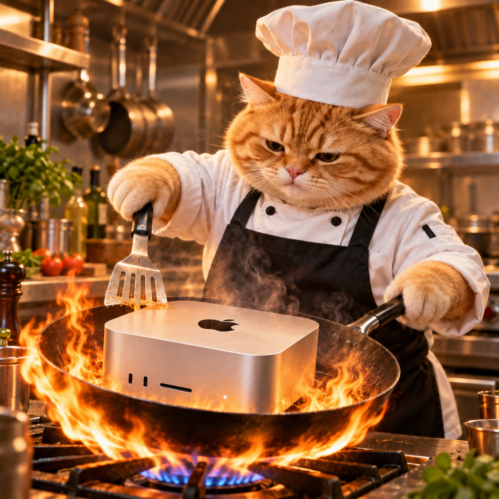

<p align="center">
  
</p>

# cook-studio

Local chat on Apple Silicon with **DeepSeek V4 Flash** and **Qwen 3.8 Flash Next**,
using native [DS4](https://github.com/antirez/ds4) Metal inference. Open WebUI,
Caddy, passkey authentication, and the remote tunnel run in containers.
Load one large model at a time. The target machine is an M3 Ultra with 256 GiB
of unified memory. Context is capped at 65,536 tokens.
The chat picker shows Qwen and DeepSeek. Choose a model when you start a chat.
Each chat stays with that model; start a new chat to use the other one. The host
gateway loads it when needed and keeps only one large model in memory. Loading
can take about a minute. Qwen uses thinking by default.
Qwen accepts images. Both models accept attached documents as extracted text.
Open WebUI summarizes older turns near 48,000 estimated tokens and keeps recent
turns. DS4 still limits each request to 65,536 tokens.
The chat composer shows estimated context used and remaining after a saved reply.

## Start

Use macOS, the Apple C/Metal toolchain, Git, `uv`, and Docker Compose.
Install the Hugging Face CLI if you need to download weights.

```sh
git submodule update --init backends/ds4
uv venv .venv
./run.sh setup qwen
./run.sh download qwen
./run.sh download deepseek
./run.sh gateway qwen
```

Use `deepseek` in place of `qwen` to load it first. The gateway listens on
`127.0.0.1:8000` for Qwen and `127.0.0.1:8001` for DeepSeek. Both expose `/v1` APIs.
Run the gateway in a tmux pane when you need inference. Press Ctrl-C to stop it.
DS4 output appears in that pane and is saved under `.local/inference-gateway/`.
Engine revisions, weight checksums, and model settings live in
[config/models.json](config/models.json). Both models use the same pinned DS4
revision. Qwen uses one native Q4 GGUF with BF16 n-grams and a matching vision
encoder. The model needs about 165 GiB of disk space; the encoder adds 617 MB.
Setup builds DS4 without downloading weights. Downloads verify file size and SHA-256.
Disk prompt caching covers the configured context with a 32 GiB budget per model.

In a second terminal, configure and start the UI:

```sh
cp config/env.example .env
chmod 600 .env
# Set WEBUI_SECRET_KEY, WEBUI_ADMIN_EMAIL, and WEBUI_ADMIN_PASSWORD in .env.
./run.sh ui
```

Open <http://localhost:3000>. Registration and optional non-chat features are off.
The existing account and chats persist in Docker volumes. Keep the single `.env`
private; each container receives only its required variables.
Attach images in Qwen chats, or attach documents in either model's chat. WebUI
extracts document text locally and sends it in full context. Files stay in its
local volume. Each file is limited to 20 MB, with at most five per request.

## Options

- **Remote passkeys:** configure Tailscale Funnel and Pocket ID, then add
  `config/compose.remote.yaml` to `COMPOSE_FILE`. Browser TLS terminates at home.
  Local HTTP is inside the trusted Mac; chat storage is not application-encrypted.
- **Web search:** add `BRAVE_SEARCH_API_KEY` and `config/compose.search.yaml`.
  Brave Search is available in new chats by default. Brave receives search
  queries; the model runs locally.
- **Browser:** add `config/compose.browser.yaml` after search and set its two
  variables from `config/env.example`. Browser tools are available in new chats
  by default for reading and interacting with specific sites, including sign-in
  when requested. The browser has no saved login sessions or credentials.
  Patchright runs in a container. Sessions expire after 15 idle minutes.
  Public HTTP/HTTPS pages are allowed; private networks and downloads are blocked.
- **Checks:** run `./run.sh check`. Run `./run.sh list` to inspect model availability.
  Run `./run.sh verify qwen` for a full weight checksum check.
  Run `./run.sh check-browser` to test a running browser container.

## Layout

`src/` contains the launcher. `config/` holds model and container configuration.
`backends/` contains the pinned DS4 source. `assets/` holds the repo artwork.
`tests/` contains offline checks. `models/` holds ignored local weights.

Credentials, runtime data, builds, results, and local `docs/` are ignored by Git.
Engines and model weights retain their upstream licenses.
